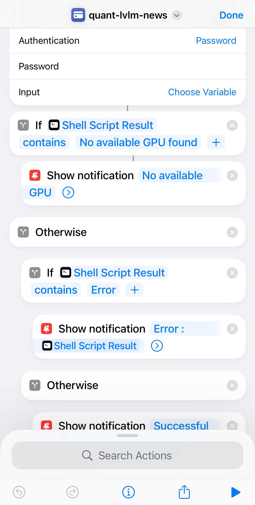

# quant-lvlm

Leveraging large vision language models (LVLM) for quantitative analysis. Current function include finance news article analysis and summarization.

- [Finance News Analysis](#finance-news-analysis)
- [Time Series Analysis](#time-series-analysis)

## Finance News Analysis
Employing LVLM to summarize and analyze finance news articles. The data are retrieved from Yahoo Finance website. Furthermore, sentiment analysis is performed by LVLM on the news article. The output is summarized and sent to the Notion database.

### Setup

The `.env` file in the root directory will be required. The format is as follows:

```
NOTION_TOKEN = <your notion API token>
NOTION_PAGE_ID = <your notion page ID of the page you want to add the news>
```

By changing the desired tickers in [`tickers.json`](tickers.json), you can analyze multiple stocks.

### Usage

Simple usage:
```
python3 quant_news.py
```
  

For added convenience, you can utilize the [Shortcut](https://support.apple.com/guide/shortcuts/welcome/ios) app on your iPhone to execute the script without needing to enter commands in a terminal. In my case, I created a shortcut that connects to a server and runs the script remotely. This approach leverages the power of iOS Shortcuts to simplify the process of running scripts on the server.

The Shortcuts app, as described in Apple's Shortcuts User Guide, allows you to create custom automations that can perform complex tasks with just a tap. By setting up a shortcut for your server connection and script execution, you can streamline your workflow and run your scripts more efficiently.




## Time Series Analysis
Stay tuned.

## TODO
Please visit [TODO.md](TODO.md) for more information.